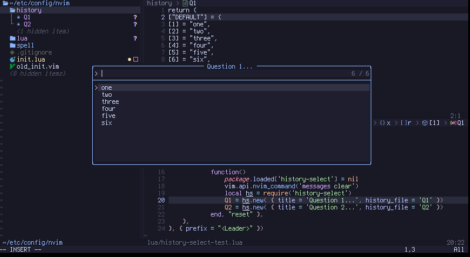

# history-select.nvim

[](https://neovim.io/)
[](http://www.lua.org)

This is a nvim lua plugin that provides a dialog box that allows selecting from past entries,
and stores new input into a history file.  

## Install

lazy package manager
```lua
return {
    'bartman/history-select.nvim'
}
```

## Usage

```lua
local mydialog = require('history-select').new( {
    title = 'My question...',
    history_file = 'question1',
    item_selected = function(self, selected)
        print("selected: " .. selected)
        print("history: " .. vim.inspect(self.history)
    end
})

vim.keymap.set("n", "<Leader>x", function()
    mydialog.ask()
end)
```



## History files

History is stored in `~/.config/nvim/history/` with the file name given as option `history_file`.
They are just lua code that is loaded with a sandboxed lua interpreter.

```lua
return {
    ["DEFAULT"] = {
        [1] = "one",
        [2] = "two",
        [3] = "three",
        [4] = "four",
        [5] = "five",
        [6] = "six",
    },
}
```

## TODO

- [ ] use `string.dump()` for serialization
- [ ] better documentation, examples of overrides, selecting different history_groups, etc
